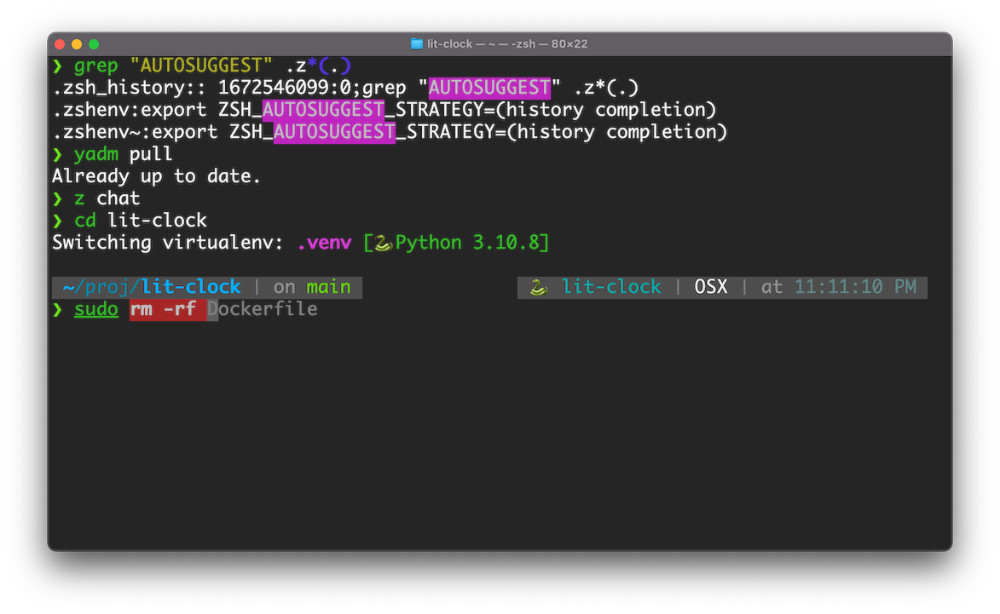

Or: how I burned a day of my holiday break doing a peculiar kind of tedious
computer maintenance.

<!-- truncate -->

## These things are complicated

If you spend any amount of time at the terminal prompt, you are no doubt aware
of the collection of `.blahblahrc` files that are used to configure the behavior
of your shell, your favorite editor, `git`, and all the other programs that
afford endless opportunity for customization. You've probably also dragged them
along from computer to computer over the years, perhaps letting them drift out
of sync, or perhaps you've invested the time to store them in some sort of
repository to keep everything tidy.

I've more or less split the difference. I did check things into a git repository
about 15 years ago, and I've made a few concerted efforts to really set things
up the way I like them. If you're not a Unix command-line afficionado.. well,
first of all, I'm not sure any of this is going to make sense. And second, you
may not be aware of how time-consuming and complicated this can get. For
example, I was really into `Emacs` for a long time, and that's a classic example
of a program with infinite configurability, if you can wrap your head around the
Lisp code to do so.. and even if you can, it's easy to spend whole days just
going through the options and playing with them. Here's a random example of a
[.emacs config file](https://tess.oconnor.cx/config/.emacs) I found online.

So apart from a few one-off efforts to optimize my setup, which have mostly
taken place when I've gotten some new religion (e.g. `zsh`), my dotfiles have
otherwise been left to rot and/or accumulate small bits of cruft over time. For
some reason, I decided yesterday was the day to have another go at it. I have a
million things I wanted to achieve during this week off from work, and that
wasn't one of them, so it was probably procrastinating something else.

## Fresh start

This time, my plan was to start with a clean slate. I took a look at the
dotfiles I was currently carrying around and realized the most important part,
my `zsh` setup, was about 15 years old. I added a bunch of stuff once when I
first discovered [Oh My Zsh][omz], and at some point later I partially moved to
[Prezto]. I think that was when I decided to try turning on all of the features
I possibly could. `zsh` can do some wild things when you turn it up to 11. So
knowing that there's probably a decade of changes since the last time I went
through all the options, I wanted to jettison any legacy baggage I had and try
to do it all from scratch, in whatever the latest and greatest fashion is.

Of course, it being that kind of thing, there is no one answer. The split
between Oh My Zsh and Prezto remains, and on top of that we now have.. well,
take a look at
[this list of zsh addons](https://github.com/unixorn/awesome-zsh-plugins). The
big thing now seems to be plugin managers. And for whatever reason, everybody
seems to feel the need to write their own "fast, modular replacement for ...".
Fortunately, I either didn't have this list or didn't realize what it was,
because I just picked [zplug] instead of investigating all of the options. That
saved me _some_ time picking out a plugin manager, but I still had to set it up,
and I still had to decide on which plugins to use.

## Configuring `zsh`

Besides [zplug], I chose to stick with [Prezto] as my configuration framework.
It provides a lot of stuff out of the box and makes it relatively easy to tweak
the settings. Where it gets confusing is that Prezto comes with a lot of its own
[modules](https://github.com/sorin-ionescu/prezto/tree/master/modules), and
pulls in a bunch of
[external plugins](https://github.com/sorin-ionescu/prezto/blob/master/.gitmodules),
so at first I had some duplicated effort adding things through zplug that were
already available by default because I was using Prezto. But I got it sorted out
and settled on these plugins (for now):

- [clvv/fasd](https://github.com/clvv/fasd): so I can type `z foo` and jump to
  any directory I've recently been in that fuzzily matches "foo".
- [b4b4r07/enhancd](https://github.com/b4b4r07/enhancd): more cd improvements:
  this one brings up an interactive menu for previous directories, history, etc.
- [MichaelAquilina/zsh-autoswitch-virtualenv](https://github.com/MichaelAquilina/zsh-autoswitch-virtualenv):
  I sometimes work on Python projects, and this activates `venv`s automatically
  when it sees them.
- [g-plane/zsh-yarn-autocompletions](https://github.com/g-plane/zsh-yarn-autocompletions):
  I don't really use `yarn`, but this was on a list I cribbed from, and more
  autocompletions are more better, right?
- [romkatv/powerlevel10k](https://github.com/romkatv/powerlevel10k): a prompt
  configuration framework that is twice as complicated as all the other modules
  put together. It has a menu-driven configuration system that writes out a
  [1600-line settings file](https://github.com/masto/dotfiles/blob/main/.p10k.zsh)
  which you can then modify further.

I also enabled the following modules in Prezto: `environment`, `terminal`,
`editor`, `history`, `directory`, `spectrum`, `utility`, `git`, `ssh`, `osx`,
`archive`, `syntax-highlighting`, `history-substring-search`, `autosuggestions`,
`completion`, and `prompt`.

Many of these have their own options. Rather than detail everything here, I'll
note that I put my dotfiles in a [public GitHub repository][my-dotfiles], so you
can just look at my
[`.zpreztorc`](https://github.com/masto/dotfiles/blob/main/.zpreztorc) if you
care to.

## Yadm, I'm day

On the subject of putting my dotfiles in a repository, as I mentioned way
earlier, I had done this once before. I didn't do anything special to manage it,
just checked a bunch of files into git. It was at least some place to stash
them, but it turned messy pretty quickly, and I didn't really keep it up to
date. So this time I wanted to make sure to start from the beginning with a
plan.

My plan was to Google "dotfiles manager". I knew this had to be a solved
problem, and of course there are
[way too many solutions](https://dotfiles.github.io/utilities/). But the first
one I saw was [yadm], and that looked good enough for me. So I'm using yadm and
I'm basically fine with it. If I start running into limitations, I'll look at
some of the fancier alternatives on that list.

## Bootstrapping

One thing I did to make my life a little bit easier was to do all of the setup
in a virtual machine (actually I just used Docker to bootstrap a clean Ubuntu
container). This way I could avoid interactions with anything else I might have
installed on my "real" computer. I made sure I could get a clean setup this way
and only then did I start to import the config to other machines I spend time
on.

Having set up a few fresh installs now, there is a bit of a chicken-and-egg
problem, for example I need to have enough `git` configuration to be able to
clone my repository. I have not automated things like installing `zsh` and
`Prezto` and `zplug`, I just go to their respective web sites and cut and paste
the curl commands (😜).

The final step was to go through my "legacy" setup and look for anything that I
had that I needed to port over. Surprisingly, there was very little. Most of
what I was turning on some of the same features that I'd already enabled, or
that are now available by default or obsoleted by something else. Just a few
aliases and environment variables were all I needed to pull over, along with
checking in my still-decades-of-garbage `.emacs` and other stuff I want to
track. I'm also being careful not to include any secrets or leak anything I
don't want in the public repository. Hopefully `yadm` will facilitate that --
this one of the places where I could see moving to a different tool if it makes
separating the public and private stuff easier.

[omz]: https://ohmyz.sh
[prezto]: https://github.com/sorin-ionescu/prezto
[zplug]: https://github.com/zplug/zplug
[yadm]: https://yadm.io
[my-dotfiles]: https://github.com/masto/dotfiles

## Ta da

And here's what it looks like with all that junk:

There are a lot of examples out there of people who have gone to far greater
lengths to make their terminals all fancy. I didn't do this to try to win a
contest, I just wanted to have a nice clean configuration that I can keep up to
date, and use it to make my interaction with the shell more pleasant and
efficient. I think I've achieved that.
