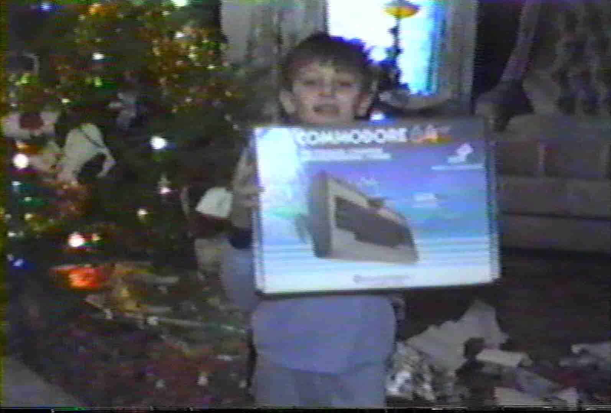

At the risk of calling further attention to the fact that I'm getting old, I
have a story to tell that begins and ends with the day Santa brought me my first
computer, a [Commodore 64](https://en.wikipedia.org/wiki/Commodore_64). Along
the way it involves a lot of media storage formats and lessons learned about
data durability.

<!-- truncate -->

It would be impossible for me to overstate the impact this moment had on the
rest of my life:

That was Christmas 1984: just over 40 years ago as I write this. I'm able to
share it on this anniversary through luck and perseverance, despite having
thought for a while that this footage had been lost forever.

(If you're only interested in the technical details, you can skip the
heartwarming backstory and go straight to [part 2](./part2.md).)

## The Original Recording

In 1984, this was the state of the art camcorder. I don't mean that ironically -
it was actually a high tech and fairly rare thing for the time.

 <small>(By <a
href="https://commons.wikimedia.org/wiki/User:David162se">David162se</a> on <a
href="https://commons.wikimedia.org/wiki/File:Sony_Betamovie_BMC-100P_2nd_view_(retouched_filtered).jpg">WikiMedia</a>,
<a href="https://creativecommons.org/licenses/by-sa/4.0/legalcode" rel="license">CC
BY-SA 4.0</a></small>)

If the word "Betamax" doesn't mean anything to you, a very quick history lesson.
In the 80s, there were two competing videotape formats: Sony's proprietary
Betamax, and VHS - the standard used by everyone else. The general consensus is
that Beta had better picture quality, but VHS ultimately won out and by 1988
Sony had given up.

I probably inherited my predilection for gadgets from my father. Though he
struggled with technology at times, he had a thing for having the latest thing.
And so we ended up with collection of home movies recorded on Beta tapes. They
go on for hours and hours, often with the camera set up on a tripod during a
holiday, with everything too dark and out of focus. But they are the only
recordings we have of that time and as happens, a lot of the people in them
aren't around anymore. So I'd like to keep them safe.

## The First Conversion

It was obvious by the early 1990s that our Betamax VCR broke down, we'd no
longer be able to watch these videos, so it was time to copy them somewhere
else. That somewhere was VHS. By this point, I had graduated to an
[Amiga 500](https://en.wikipedia.org/wiki/Amiga_500), a computer that was known
for its video capabilities, and my tendency to turn things into complicated
projects was fully developed. So we gathered all of the tapes and set about
dubbing them onto VHS tapes while adding introductory titles courtesy of my
Amiga and some software I've long since forgotten the name of.

This was of course a very analog and very lossy conversion. It just involved
plugging some RCA cables between the two VCRs, pressing play on one, and record
on the other. But it did succeed in producing a copy of the movies that could
theoretically be watched into the future. Even in 2025, a VHS player wouldn't be
hard to track down. In fact, I have one under the TV, but I say theoretically
because those tapes (both Beta and VHS) have long since been lost. But all is
not lost, because before that happened there was...

## Another Format Conversion

Sometime around 2002, I found myself with a Windows PC (a story for another
time) capable of capturing video and burning DVDs. Over the course of several
months, I set myself to the project of once again converting all of the home
movies, this time copying them from VHS and making DVDs with a program called
Pinnacle Studio. I also put an inordinate amount of effort into making chapters,
title screens, and labels for the discs. I even had an ink jet printer that
could print directly onto the DVDs. I made extra copies and set up a little
production line in my kitchen where I put them in padded mailers and sent them
out to my parents. Finally, I thought, these memories would be preserved forever
in digital form.

The discs sat on shelves, in moving boxes, and in the backs of various cabinets
for many years, until eventually I learned the unpleasant truth.

## Optical Media's Shelf Life

At some point, I tried to watch one of these DVDs and I found that it wouldn't
play reliably. It wasn't the player, and it wasn't just the one disc. As it
turns out, writable CDs and DVDs can fail in as little as 5 years. They contain
a dye that is "burned" by the laser to write data, and over time the dye fades,
causing the disc to become unreadable. I had no idea that this would happen, and
by that point the tapes were gone, as were the captures. Computer storage wasn't
that big in 2002, so I couldn't keep the project files around after the DVDs
were made. I had the sickening realization that these home movies were, finally,
lost forever. Over the following years, I would occasionally stumble across one
of these videos and try to play them, and sometimes I could see parts of it but
they would always hit a point where the DVD player did nothing but make whirring
and clicking noises as it tried to find the faded track. It seemed hopeless.

## A Christmas Miracle

While at a family holiday party, my sister mentioned that she had recently
watched one of these home movies. Needless to say, I was surprised that she had
a working copy of the DVDs, so I asked to borrow them in order to try to recover
as much as possible. I went home with a box of discs and set to work copying
them to my computer. As it turns out, this was a rather involved process, and
that's where we pick up in [Part 2 of this story](./part2.md).
