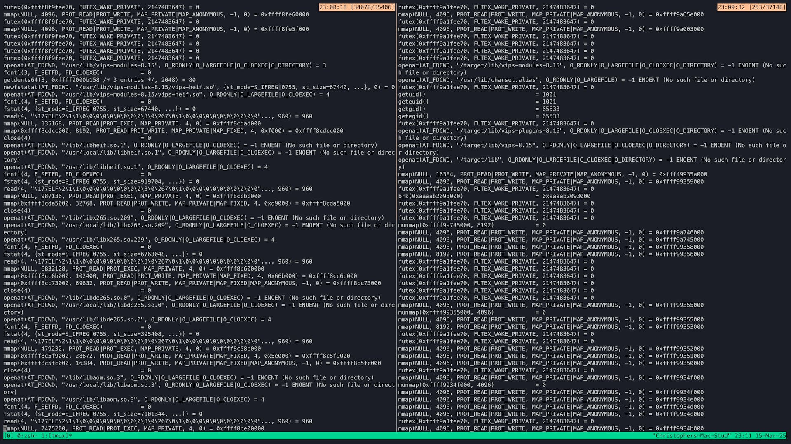

Here's the story of a recent troubleshooting session that had me questioning
everything I knew about computers. And yet it turned out to be a one-line fix.

<!-- truncate -->

## Computers, right?

As a software developer with.. some years of experience.. I have seen a lot of
things. I can't say this is the weirdest or most difficult bug, but it sure was
a head-scratcher. If you're inclined to get nerd-sniped into wanting to see if
you can find the problem, you may (or may not) want to look at this repository
before reading on.

https://github.com/masto/vips-issue

There you will find a working example of the problem I was having, trimmed down
to under 100 lines. I think if you get lucky and start off on a certain path,
you'll probably find it right away, but set out at a slightly different angle
and you might get lost in the woods forever. I'm not sure exactly how much time
I spent on this, because I kept stopping to show my friends and argue with them
about their theories, and then I had a big meeting in the middle. Eventually I
started showing the person I was meeting with what I'd been working on and we
got stuck on this together and ultimately puzzled it out.

## The requisite background

I've been working on a web application that does some stuff with photos. The
user uploads a photo from their device, and at one point I need to show it to
them. I'm using [Next.js](https://nextjs.org/), which has a neat
[image optimization feature](https://nextjs.org/docs/app/building-your-application/optimizing/images),
so I thought I'd just use their `<Image>` component, but I quickly discovered
that it doesn't do all the things I need, and in particular it
[doesn't support HEIC](https://github.com/vercel/next.js/discussions/30043).
HEIC will be a recurring theme here: it's the format Apple is moving to for
iPhone photos, and that's important to my app. Side note: you might see "HEIF"
and "HEVC", which are all related -
[HEIC is a HEIF file with HEVC encoding](https://en.wikipedia.org/wiki/High_Efficiency_Image_File_Format).
This alphabet soup is not relevant to the discussion here, but different names
pop up in debug logs, so the easiest thing to do is just consider them the same
thing.

Back to the problem at hand, I decided that a workaround for HEIC support would
be to just convert everything to JPEG (at least for thumbnails). I looked at a
few different options, and I settled on `vips`. It says on
[the web site](https://libvips.org) that "Compared to similar libraries, libvips
runs quickly and uses little memory", and that's good enough for me. I've used
ImageMagick in the past, and it's a bit of a jumble. This seemed like maybe a
clean, modern replacement. It took a little effort to interpret the
documentation, but once I sorted out that I could run
`vips thumbnail input.heic output.jpg <size>`, I was good to go, and I jammed it
into a processing pipeline that my app already runs after receiving a new photo.

## The bug

The day after pushing, and testing, a new build that had been specifically to
fix the HEIC issue, I tried it again and noticed it was broken. I just fixed
that, what the heck? I quickly narrowed the symptoms down this very strange
behavior:

- When the server is first started, it always successfully processes the first
  photo uploaded.
- JPEG files are always successfully processed.
- Any HEIC file after the first upload always fails.
- The error message from vips is:
  `VipsForeignLoad: "<filename>" is not a known file format`

 Here, I uploaded the same file twice, so there
should be two identical thumbnails. The second is broken.

It got weirder. I am running this app in a Docker container, so I used the
`docker exec` command to start a shell _in the same container_ as the server,
and I ran the _exact same vips command_ on _exactly the same file_ that it said
in the logs was not a known file format, and it worked fine. I tested it
repeatedly, it was not intermittent. But the failure was 100% guaranteed to
happen on the server every time. If I restarted it, I could process one HEIC
file and then they would all fail again.

## The hair-pulling

I must necessarily leave a lot out in order to condense hours of troubleshooting
into this post. I tested a lot of ideas that went nowhere, like maybe the file
somehow wasn't fully written when vips was run on it, but I tried running
`md5sum` before vips, and confirmed the bits were identical in the successful
and unsuccessful executions.

The first real clue came from running vips under
[strace](https://en.wikipedia.org/wiki/Strace). I figured there has to be
something different between the good and bad runs, and I hoped it would show up
in their system calls. I matched up the output side by side. Lo and behold,
there was a very notable difference:

[](vips-strace.png)

On the left, the first, "good" vips execution. On the right, the second, "bad"
one. Where they start to diverge, the good one says:

```
openat(AT_FDCWD, "/usr/lib/vips-modules-8.15", O_RDONLY|O_LARGEFILE|O_CLOEXEC|O_DIRECTORY) = 3
fcntl(3, F_SETFD, FD_CLOEXEC)           = 0
getdents64(3, 0xffff9000b158 /* 3 entries */, 2048) = 80
newfstatat(AT_FDCWD, "/usr/lib/vips-modules-8.15/vips-heif.so", {st_mode=S_IFREG|0755, st_size=67440, ...}, 0) = 0
openat(AT_FDCWD, "/usr/lib/vips-modules-8.15/vips-heif.so", O_RDONLY|O_LARGEFILE|O_CLOEXEC) = 4
```

To translate into semi-English, it looks in a directory
`/usr/lib/vips-modules-8.15`, finds a file called `vips-heif.so`, and opens it.
It goes on to do shared-library-ish things, like reading and mmapping it.
Compare with the bad one:

```
openat(AT_FDCWD, "/target/lib/vips-modules-8.15", O_RDONLY|O_LARGEFILE|O_CLOEXEC|O_DIRECTORY) = -1 ENOENT (No such file or directory)
```

Here we see an attempt to access `/target/lib/vips-modules-8.15`, which doesn't
exist. Indeed, it doesn't exist in that container. And as we can now deduce,
`vips-heif.so` must be a module that allows vips to read HEIC files. Trying to
load that module from the wrong place would explain why it doesn't think the
file is a valid format. But this just changes the mystery. How is it possible
that executing the same exact command twice in a row, it would behave in a
different and bizarre way? What is `/target`, where did it come from, and what's
causing it to suddenly pop up on the second run of vips?

I looked at the obvious things, yes. My code never mentions `/target`. You can
look at it too,
[search the repository](https://github.com/search?q=repo%3Amasto%2Fvips-issue%20target&type=code)
if you like. That's not it. It started to feel like somehow the first execution
was doing something to influence the second one, but what can a child process
possibly communicate from beyond the grave? At this point, I and everyone I know
start to mumble a lot of things that end with "..no, that's impossible, unix
doesn't work that way". A bunch of dead ends later, and I decided to look at the
source code of vips. How exactly does it decide where to look for modules?

## Spelunking

We start out in
[init.c](https://github.com/libvips/libvips/blob/55e06ac7fe869902cdff0158d0f82acdb154dbdb/libvips/iofuncs/init.c#L604),
where we find:

```c
vips_load_plugins("%s/vips-modules-%d.%d",
    libdir, VIPS_MAJOR_VERSION, VIPS_MINOR_VERSION);
```

Good start. Whence comes `libdir`? Not too far away,
[we find](https://github.com/libvips/libvips/blob/55e06ac7fe869902cdff0158d0f82acdb154dbdb/libvips/iofuncs/init.c#L534)

```c
if ((prefix = g_getenv("VIPSHOME")))
    g_info("VIPSHOME = %s", prefix);
if (!(prefix = vips_guess_prefix(argv0, "VIPSHOME")) ||
    !(libdir = vips_guess_libdir(argv0, "VIPSHOME")))
    return -1;
```

Now that's interesting. So I added a call to `env` before running vips, in order
to dump out all of the environment variables. That can't be it, but we might as
well look. Around this point I also discovered that I can set
`G_MESSAGES_DEBUG=VIPS` to get vips to output its own debug messages, so I
turned that on as well. And here's what we see on the bad run (truncated to the
end):

```text
__NEXT_PRIVATE_ORIGIN=http://localhost:3000
NEXT_DEPLOYMENT_ID=
__NEXT_PRIVATE_RUNTIME_TYPE=
G_MESSAGES_DEBUG=VIPS
VIPSHOME=/target
VIPS-INFO: 03:45:39.584: VIPSHOME = /target
VIPS-INFO: 03:45:39.584: VIPS_PREFIX = /usr
VIPS-INFO: 03:45:39.584: VIPS_LIBDIR = /usr/lib
VIPS-INFO: 03:45:39.584: prefix = /target
VIPS-INFO: 03:45:39.584: libdir = /target/lib
VIPS-INFO: 03:45:39.584: searching "/target/lib/vips-modules-8.15"
VIPS-INFO: 03:45:39.584: searching "/target/lib/vips-plugins-8.15"
VIPS-INFO: 03:45:39.584: im_load_plugins: searching "/target/lib/vips-8.15"
VIPS-INFO: 03:45:39.584: im_load_plugins: searching "/target/lib"
VipsForeignLoad: "/tmp/83c790a7eeac9310" is not a known file format
```

What the??! Seriously, how is that possible? I never set VIPSHOME. I never even
knew about VIPSHOME. Why does it pop up out of nowhere, and why only the second
time it's run? This is definitely what's causing the failure, but it still makes
no sense!

I go
[searching through the code](https://github.com/search?q=repo%3Alibvips%2Flibvips%20VIPSHOME&type=code)
for every mention of VIPSHOME, but the only place it's mentioned outside of
comments is in that one place, and it's in a getenv call, so it can't even be
vips that's responsible for setting it. And even if it was, environment
variables don't carry over from a child process after it exits. This really
threw me down a rabbit hole of questioning assumptions, and I even spent a bunch
of time in the Node.js source code trying to make sure `spawn` wasn't doing
something exceedingly weird. It's Node, so of course it is, but not in the way I
was worried about.

## Would you like me to finally get to the answer?

I discovered two things at approximately the same time. First, I need to correct
something I said in the previous paragraph which wasn't entirely accurate. I
said there are no other mentions of VIPSHOME, which _is_ correct, but that
doesn't mean it never sets it. See that call to `vips_guess_prefix`? Let's take
a look at that interesting little function:

```c
const char *
vips_guess_prefix(const char *argv0, const char *env_name)
{
    const char *prefix;

    /* Already set?
     */
    if ((prefix = g_getenv(env_name)))
        return prefix;

#ifdef G_OS_WIN32
    prefix = vips__windows_prefix();
#else  /*!G_OS_WIN32*/
    {
        char *basename;

        basename = g_path_get_basename(argv0);
        prefix = guess_prefix(argv0, basename);
        g_free(basename);
    }
#endif /*G_OS_WIN32*/

    g_setenv(env_name, prefix, TRUE);

    return prefix;
}
```

There, in the second to last line. `g_setenv(env_name, prefix, TRUE)`. How dare
you. Yes, for some reason, this function doesn't just return the "guessed"
prefix, it "as a side effect, sets the environment variable" (per a comment
above this function). Digging a little deeper reveals that it sets it to a
compiled-in value. This seems like a massive clue, but the missing link is still
how it's possible for vips to modify the environment of a sibling.

Perhaps you've realized that I'm being deliberately misleading, because I wanted
you to be stuck on the same faulty thought process I was stuck on. It's _not_
possible to modify the environment of a sibling. Only parent environment
variables are inherited. The way I thought computers work is indeed how they
work. The problem is that sometimes it turns out that the impossible thing is
actually what's happening, and when that has bit you a few times, you don't
always want to rule it out. But in this case, nothing impossible is happening.

## Ok already, the answer

I was missing something in the logs, focusing on the bad runs. In the good,
first run, VIPSHOME is not set, and that's all I paid attention to. Here's a
closer look at what shows up in the logs of a "good" run when I turn on
G_MESSAGES_DEBUG=VIPS, and the last clue I needed to jump up and do the "oh. no.
oh geez. oh my god." thing when I actually noticed it.

```text
VIPS-INFO: 03:45:18.438: found /usr/lib/vips-modules-8.15
VIPS-INFO: 03:45:18.438: using configure-time prefix
VIPS-INFO: 03:45:18.438: VIPS_PREFIX = /usr
VIPS-INFO: 03:45:18.438: VIPS_LIBDIR = /usr/lib
VIPS-INFO: 03:45:18.438: prefix = /usr
VIPS-INFO: 03:45:18.438: libdir = /usr/lib
VIPS-INFO: 03:45:18.438: searching "/usr/lib/vips-modules-8.15"
VIPS-INFO: 03:45:18.438: loading "/usr/lib/vips-modules-8.15/vips-heif.so"
VIPS-INFO: 03:45:18.442: searching "/usr/lib/vips-plugins-8.15"
VIPS-INFO: 03:45:18.442: im_load_plugins: searching "/usr/lib/vips-8.15"
VIPS-INFO: 03:45:18.442: im_load_plugins: searching "/usr/lib"
VIPS-INFO: 03:45:18.453: heifload: ignoring nclx profile
VIPS-INFO: 03:45:18.455: heifload: ignoring nclx profile
VIPS-INFO: 03:45:18.750: threadpool completed with 4 workers
VIPS-INFO: 03:45:18.821: set stack size to 2048k
VIPS-INFO: 03:45:18.821: g_getenv("PATH") == "/usr/local/sbin:/usr/local/bin:/usr/sbin:/usr/bin:/sbin:/bin"
VIPS-INFO: 03:45:18.821: looking in "/usr/local/sbin" for "sharp"
VIPS-INFO: 03:45:18.821: looking in "/usr/local/bin" for "sharp"
VIPS-INFO: 03:45:18.821: looking in "/usr/sbin" for "sharp"
VIPS-INFO: 03:45:18.821: looking in "/usr/bin" for "sharp"
VIPS-INFO: 03:45:18.821: looking in "/sbin" for "sharp"
VIPS-INFO: 03:45:18.821: looking in "/bin" for "sharp"
VIPS-INFO: 03:45:18.821: trying for dir = "/app/sharp", name = "sharp"
VIPS-INFO: 03:45:18.821: canonicalised path = "/app"
VIPS-INFO: 03:45:18.821: VIPS_PREFIX = /target
VIPS-INFO: 03:45:18.821: VIPS_LIBDIR = /target/lib
VIPS-INFO: 03:45:18.822: prefix = /target
VIPS-INFO: 03:45:18.822: libdir = /target/lib
VIPS-INFO: 03:45:18.831: residual reducev by 0.448179
VIPS-INFO: 03:45:18.831: reducev: 15 point mask
VIPS-INFO: 03:45:18.831: reducev: using vector path
VIPS-INFO: 03:45:18.831: reducev sequential line cache
VIPS-INFO: 03:45:18.831: residual reduceh by 0.448179
VIPS-INFO: 03:45:18.831: reduceh: 15 point mask
VIPS-INFO: 03:45:18.858: threadpool completed with 4 workers
```

You have to know one more thing for this to come together. Remember when I said
back at the beginning that I'm using that Next.js `<Image>` component? Remember
how it does "optimization"? Well, uses a package called
[sharp](https://sharp.pixelplumbing.com/) to do the heavy lifting. And just
guess what library sharp uses under its hood? You guessed it, vips. And this is
where Lieutenant Columbo gets to do his "one more thing" speech and lay it all
out.

**Here's how it happened:** the user uploaded a file. My code shelled out to
`vips thumbnail` on it, and it worked as expected, exiting cleanly and leaving
nothing behind. Then the upload handler triggered a re-render of the page, which
displays a thumbnail of the uploaded file using the Next.js `<Image>` component.
This rendering all happens in the Node.js-based Next.js web server. Because this
component, through its use of `sharp` and sharp's use of `libvips`, runs in the
web server process, it modifies the _web server's environment_ when it hits that
`vips_guess_prefix` code. And I guess however it was built, it was built with
`VIPS_PREFIX=/target`. So it was actually the _displaying of the thumbnail_
which caused `VIPSHOME` to be set to `/target` in the Node process. So the _next
time_ it spawned a vips process, vips couldn't find the library it needed to
read HEIC files, and it failed.

I don't even know who to blame here. This is one of those things that only
results from a bizarre interaction between many different things. Next.js's use
(indirectly) of vips, plus the way it's compiled, plus a strange thing vips does
with its environment, plus the way I'm using it, plus the way it's set up in
this Docker image... oh yeah, I didn't even mention that. I couldn't reproduce
it in my dev environment, because it turns out that in the Ubuntu version I'm
using, vips is statically linked with libheif, so it doesn't have or need the
external .so module. But in the Docker image, it's using Alpine and a
dynamically linked libheif. So many variables that lined up to break this.

## The fix

And to unbreak it, I added `delete process.env.VIPSHOME` before spawning vips.
The end.

I hope you enjoyed this adventure. I don't have any way to get feedback on my
blog, but you can find me in various places through https://masto.me/ if you'd
like to follow or yell at me.
